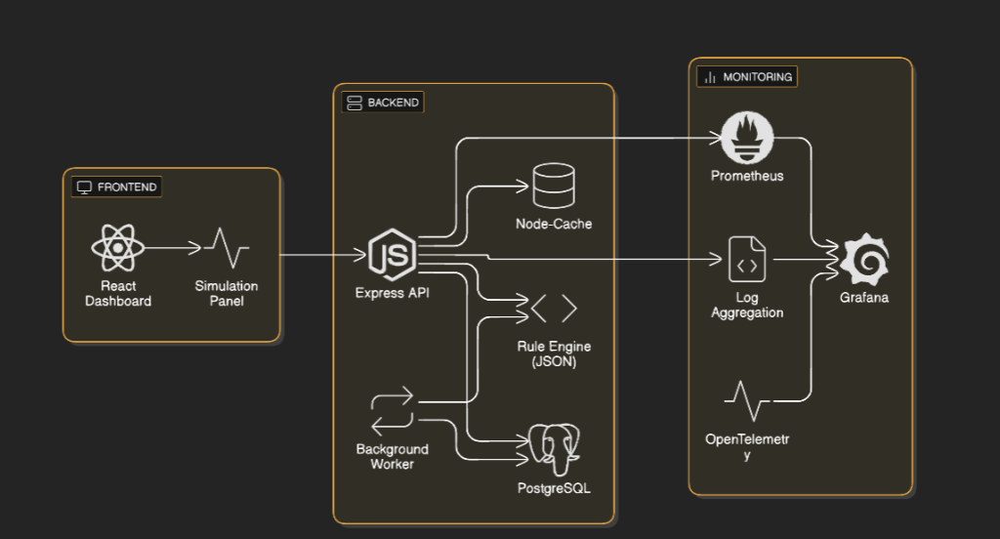

# 📈 Intelligent Alert Escalation & Monitoring System  

     

---  

## Table of Contents  

| # | Section |
|---|---------|
| 1 | **Executive Summary** |
| 2 | **System Overview** |
| 3 | **Architecture Diagram** |
| 4 | **Modules Overview** |
| 5 | **Alert Lifecycle** |
| 6 | **Rule Engine** |
| 7 | **Simulation Panel** |
| 8 | **Dashboard Features** |
| 9 | **Setup Instructions** |
|10| **Environment Variables** |
|11| **API Documentation** |
|12| **Database Schema** |
|13| **Caching Strategy** |
|14| **Background Job** |
|15| **Tracing & Logging** |
|16| **Testing** |
|17| **Running End‑to‑End** |
|18| **Troubleshooting** |
|19| **Contributing** |
|20| **License** |

---  

## 1. Executive Summary  

The **Intelligent Alert Escalation & Monitoring System** is a full‑stack, production‑grade platform that ingests alerts from multiple fleet‑monitoring modules (Safety, Compliance, Feedback), applies a **rule‑engine** to automatically **escalate**, **auto‑close**, or **resolve** them, and surfaces real‑time analytics on a modern React dashboard.  

Key benefits:  

| ✅ | Benefit |
|---|---------|
| **Real‑time visibility** | Trend graphs, top‑offender leader‑board, recent event stream |
| **Automation** | Rules defined in JSON/YAML drive escalation & auto‑close without code changes |
| **Observability** | Prometheus metrics, Grafana dashboards, Loki logs, OpenTelemetry tracing |
| **Scalability** | Stateless API, Docker‑compose, caching via Node‑Cache, background worker |
| **Developer‑friendly** | TypeScript, Prisma ORM, comprehensive tests, CI‑ready |

---  

## 2. System Overview  

```
+-------------------+          +-------------------+          +-------------------+
|   Frontend (React|  HTTP    |   Backend (Node) |  DB      |   PostgreSQL      |
|   + Recharts)    | <------> |   Express + TS   | <------> |   Prisma ORM      |
+-------------------+          +-------------------+          +-------------------+
        ^                               ^                               ^
        |                               |                               |
        |                               |                               |
        |                               |                               |
        |                               |                               |
        |                               |                               |
   +------------+                 +------------+                +------------+
   | Simulation |   Event Bus    | Rule Engine|   Cache (Node‑Cache)   |
   | Panel      | <------------> | (JSON)    | <----------------------|
   +------------+                +------------+                       |
        ^                                                          |
        |                                                          |
   +------------+                                            +------------+
   | Background |  Cron (5‑min)   | Auto‑Close Worker      | Monitoring |
   | Worker     | <-------------> | (Escalation Rules)     | (Prom/ Graf)|
   +------------+                                            +------------+
```

---  

## 3. Architecture Diagram  



---  

## 4. Modules Overview  

| Module | Responsibility | Example Alerts |
|--------|----------------|----------------|
| **Safety** | Detect unsafe driving events (overspeed, harsh braking) | `overspeed`, `harsh_braking` |
| **Compliance** | Verify driver/document compliance | `expiring_documents`, `pending_service` |
| **Feedback** | Capture driver/passenger feedback | `bad_review`, `sharp_turn` |

All modules POST to **`/alerts`** with a unified payload:

```json
{
  "alertId": "uuid",
  "sourceType": "overspeed",
  "severity": "CRITICAL",
  "timestamp": "2025-11-23T10:12:00Z",
  "status": "OPEN",
  "metadata": { "driverId": "D123", "speed": 120 }
}
```

---  

## 5. Alert Lifecycle  

```
OPEN → ESCALATED → AUTO‑CLOSED → RESOLVED
```

| Transition | Trigger |
|------------|---------|
| **OPEN → ESCALATED** | Rule engine detects count/window threshold |
| **ESCALATED → AUTO‑CLOSED** | Auto‑close rule (e.g., document renewed) |
| **ANY → RESOLVED** | Manual UI action (`resolveAlert`) |

The UI shows the current status badge and a **history timeline** for each alert.

---  

## 6. Rule Engine  

- **Location:** `src/rules/rules.json` (editable at runtime)  
- **Format:** Simple JSON DSL  

```json
{
  "overspeed": { "escalate_if_count": 3, "window_mins": 60 },
  "bad_review": { "escalate_if_count": 2, "window_mins": 1440 },
  "expiring_documents": { "auto_close_on": "document_renewed" },
  "compliance": { "auto_close_if": "document_valid" }
}
```

**How it works**

1. When a new alert is saved, `AlertService.applyEscalationRules` reads the DSL.  
2. It queries recent alerts of the same `sourceType` within the defined window.  
3. If the count exceeds the threshold, status changes to **ESCALATED**.  
4. Background worker runs `applyAutoCloseRules` every 5 min to auto‑close matching alerts.

---  

## 7. Simulation Panel  

Located at `frontend/src/components/SimulationPanel.tsx`.  

- Allows developers / QA to **create synthetic alerts** quickly.  
- Provides a dropdown for source type, severity, driver ID, and custom metadata.  
- After creation it calls `POST /alerts` and triggers an immediate dashboard refresh via `onAlertCreated`.  

---  

## 8. Dashboard Features  

| Feature | Description |
|---------|-------------|
| **Summary Cards** | Open, Critical, Warning, Info, Auto‑Closed counts |
| **Top Drivers Leader‑board** | Shows drivers with most open/escalated alerts |
| **Trend Graph** | Line chart (24 h / 7 d) of alert counts per status |
| **Events Stream** | Real‑time audit‑log feed (created, escalated, auto‑closed, resolved) |
| **Alert Modal** | Click an alert → modal with history, metadata, manual resolve |
| **Range Selector** | Buttons to toggle 24 h vs 7 d view (frontend passes `range` query param) |
| **Responsive** | Mobile‑first layout, dark‑mode ready |

---  

## 9. Setup Instructions  

### Prerequisites  

| Tool | Minimum Version |
|------|-----------------|
| **Node.js** | 18.x |
| **npm** | 9.x |
| **Docker & Docker‑Compose** | 2.0+ |
| **PostgreSQL** | 13 (Docker will spin it up) |

### Backend  

```bash
# Clone the repo (already done)
cd moveinsync_assignment

# Install deps
npm ci

# Create .env (see section 10)
cp .env.example .env
# edit .env as needed

# Run migrations & seed (Prisma)
npx prisma migrate dev --name init
npx prisma db seed   # optional demo data

# Start the API
npm run dev          # runs ts-node-dev on src/app.ts
```

### Frontend  

```bash
cd frontend
npm ci
npm run dev          # Vite dev server on http://localhost:5173
```

### Docker‑Compose (All‑in‑One)  

```bash
docker-compose up --build
# Services:
#   - api   : http://localhost:3000
#   - web  : http://localhost:5173
#   - db   : PostgreSQL
#   - prometheus, grafana, loki
```

---  

## 10. Environment Variable Examples  

```dotenv
# .env (backend)
DATABASE_URL=postgresql://postgres:password@db:5432/moveinsync
PORT=3000
NODE_ENV=development

# Clerk (authentication)
NEXT_PUBLIC_CLERK_PUBLISHABLE_KEY=pk_test_...
CLERK_SECRET_KEY=sk_test_...

# Monitoring
PROMETHEUS_PORT=9100
OTEL_EXPORTER_OTLP_ENDPOINT=http://otel-collector:4317
```

---  

## 11. API Documentation  

| Method | Endpoint | Description | Request Body | Response |
|--------|----------|-------------|--------------|----------|
| `POST` | `/alerts` | Ingest a new alert | See **Alert Payload** above | `{ alert: Alert }` |
| `GET` | `/dashboard/summary` | Counts by status & severity | – | `{ byStatus, bySeverity }` |
| `GET` | `/dashboard/top-drivers` | Top‑5 drivers with open/escalated alerts | – | `{ drivers: [{ driverId, openAlerts, escalatedAlerts, totalAlerts }], updatedAt }` |
| `GET` | `/dashboard/trends?range=24h|7d&timezoneOffset=-330` | Time‑series data for the selected range | – | `[{ date, OPEN, ESCALATED, AUTO_CLOSED, RESOLVED }]` |
| `GET` | `/dashboard/events` | Recent audit‑log events (limit 20) | – | `[{ id, type, timestamp, details }]` |
| `GET` | `/dashboard/alerts/:id` | Full alert details + history | – | `{ alert, history }` |
| `PATCH`| `/alerts/:id/resolve` | Manual resolution | – | `{ alert }` |
| `GET` | `/health` | Liveness probe | – | `{ status: "ok" }` |

*All endpoints are protected by Clerk middleware (`authMiddleware.ts`).*

---  

## 12. Database Schema  

```prisma
model Alert {
  id          String      @id @default(uuid())
  sourceType  String
  severity    String
  timestamp   DateTime    @default(now())
  status      AlertStatus @default(OPEN)
  metadata    Json?
  fingerprint String?     @unique
  history     AlertHistory[]
}

model AlertHistory {
  id        String   @id @default(uuid())
  alertId   String
  status    AlertStatus
  changedAt DateTime @default(now())
  reason    String?
  alert     Alert    @relation(fields: [alertId], references: [id])
}

model AuditLog {
  id        String   @id @default(uuid())
  type      String
  timestamp DateTime @default(now())
  details   Json
}
```

`AlertStatus` enum: `OPEN`, `ESCALATED`, `AUTO_CLOSED`, `RESOLVED`.

---  

## 13. Caching Strategy  

- **Node‑Cache** (`src/services/cacheService.ts`) – in‑memory, TTL = 30 s (dashboard data)  
- **Cache Keys**  
  - `alert_summary`  
  - `top_drivers`  
  - `alert_trends_{range}`  
- **Invalidation**  
  - After **create**, **update**, **resolve** → `dashboardCache.invalidate*()` (see `alertService.ts`)  
  - Background worker also clears `alert_trends` when auto‑close runs  

Cache hit/miss metrics are exposed to Prometheus (`cache_hits_total`, `cache_misses_total`).

---  

## 14. Background Job  

File: `src/jobs/autoCloseWorker.ts` (started via `node-cron` in `src/app.ts`).  

- Runs every **5 minutes**.  
- Steps:  
  1. Pull alerts with status `OPEN` or `ESCALATED`.  
  2. For each alert, evaluate auto‑close rules from `rules.json`.  
  3. If condition met → update status to `AUTO_CLOSED`, insert `AlertHistory` entry, emit audit log.  
  4. Invalidate `alert_trends` cache.  

---  

## 15. Tracing & Logging  

- **Logging**: `src/utils/logger.ts` – Winston JSON logger (writes to console & Loki).  
- **Tracing**: OpenTelemetry SDK configured in `src/tracing.ts`.  
  - Spans for each API request, rule‑engine evaluation, background job.  
  - Exported to OTLP collector (Grafana Loki can ingest traces).  

---  

## 16. Testing Instructions  

```bash
# Unit tests (Jest)
npm run test

# Integration tests (Supertest + in‑memory SQLite)
npm run test:integration

# End‑to‑end (Playwright) – optional
npm run e2e
```

Key test suites:  

- `alertService.test.ts` – rule engine, cache invalidation.  
- `dashboardController.test.ts` – trend aggregation, range handling.  
- `worker.test.ts` – auto‑close logic.  

All tests should pass with `npm test`.

---  

## 17. Running the System End‑to‑End  

1. **Start Docker Compose** (includes DB, Prometheus, Grafana, Loki).  

   ```bash
   docker-compose up -d
   ```

2. **Run Backend**  

   ```bash
   npm run dev   # http://localhost:3000
   ```

3. **Run Frontend**  

   ```bash
   cd frontend
   npm run dev   # http://localhost:5173
   ```

4. **Create Sample Alerts** via the **Simulation Panel** or `curl`:

   ```bash
   curl -X POST http://localhost:3000/alerts \
        -H "Content-Type: application/json" \
        -d '{"sourceType":"overspeed","severity":"CRITICAL","timestamp": "2025-11-23T10:00:00Z","status":"OPEN","metadata":{"driverId":"D001","speed":120}}'
   ```

5. **Watch the Dashboard** – open the web UI, see the cards update, the trend graph shift, and the events stream display the new alert.  

6. **Observe Monitoring** – open Grafana (`http://localhost:3001`) and view the *Alert Service* dashboard (pre‑built in `docker-compose.yml`).  

---  

## 18. Troubleshooting  

| Symptom | Likely Cause | Fix |
|---------|--------------|-----|
| **Dashboard shows 0 alerts** | DB not seeded or API not reachable | Verify `DATABASE_URL`, run `npx prisma migrate dev`, check backend logs |
| **Trend graph empty** | `timezoneOffset` missing or `range` param wrong | Ensure frontend sends `range` and `timezoneOffset`; check `alertRepository.getAlertTrends` |
| **Cache never invalidates** | `dashboardCache.invalidate*` not called after alert creation | Confirm `alertService.createAlert` flow; add `console.log` or logger statements |
| **Prometheus metrics missing** | `/metrics` endpoint not exposed | Ensure `express-prometheus-middleware` is imported in `src/app.ts` |
| **Background job not running** | `node-cron` not started or process exited | Check `npm run dev` console for `Cron job started`; verify timezone of host |
| **Authentication errors** | Clerk keys missing or expired | Set `NEXT_PUBLIC_CLERK_PUBLISHABLE_KEY` and `CLERK_SECRET_KEY` in `.env` |
| **Docker containers fail** | Port conflict or missing env vars | Run `docker-compose logs` to see error; adjust host ports or env file |

---  

## 19. Contributing  

1. Fork the repository.  
2. Create a feature branch (`git checkout -b feat/your-feature`).  
3. Follow the **coding style** (Prettier + ESLint).  
4. Write tests for any new logic.  
5. Submit a PR with a clear description and screenshots if UI changes.  

---  

## 20. License  

MIT © 2025 

---  


